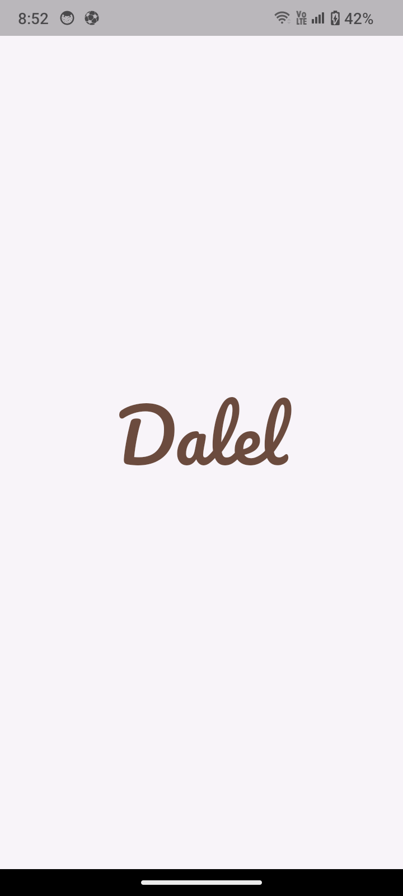
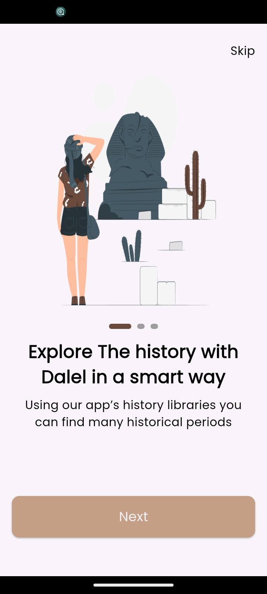
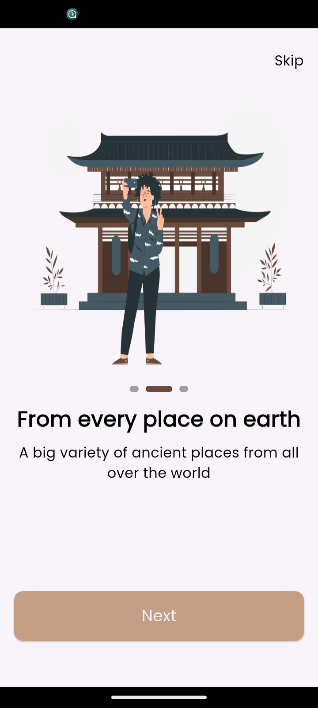
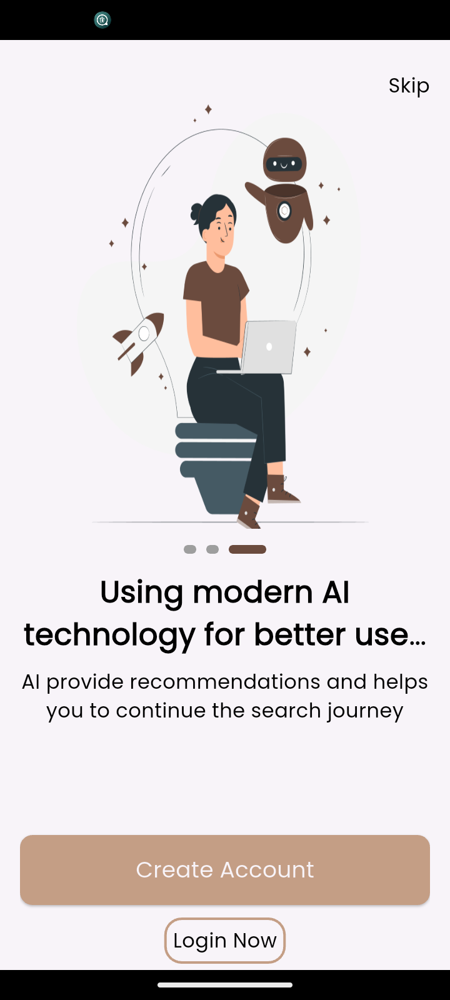
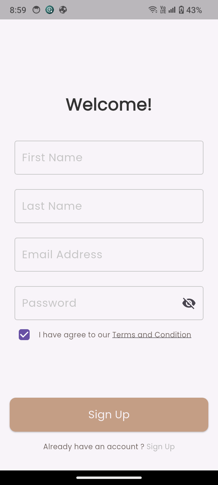
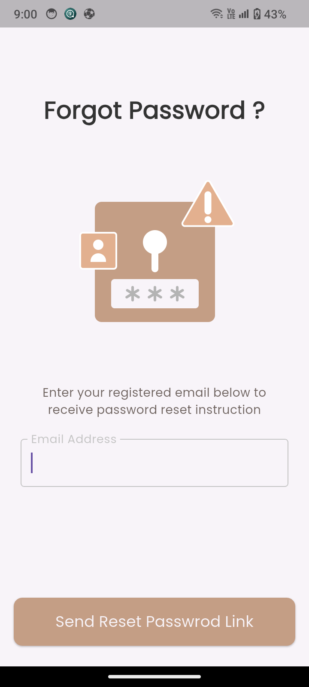
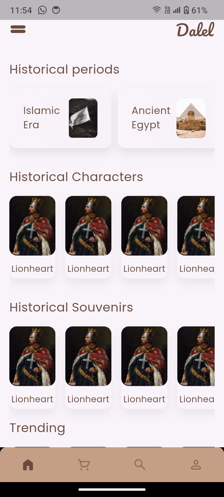
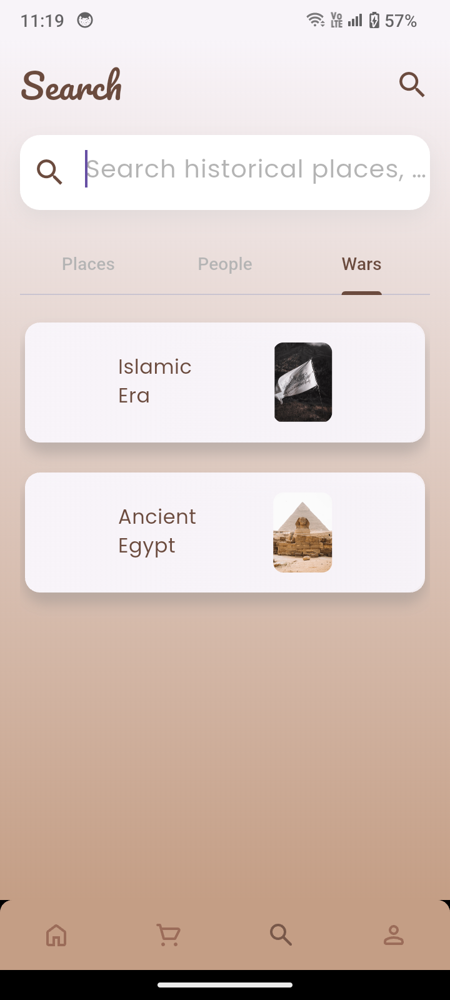
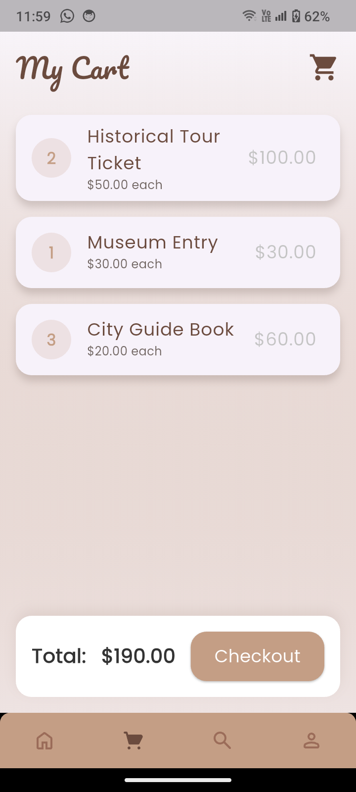

# 🗺️ Dalel App – Travel Guide Portfolio Project


⚠️ Note: This repository is for **portfolio purposes only**.  
Dalel App is a demo project showcasing Flutter UI, Firebase integration, and BLoC state management. It is not intended as a live client application.

This project contains UI code, screenshots, and demo assets for portfolio presentation. It serves as a visual reference of my Flutter development skills.
---

## 🎬 Demo Videos  

- **Mobile App Demo**  
  [](assets/video/dalel_app.mp4)  


📂 Videos are stored in the `assets\video` folder for reference purposes.  

---
🎬 Demo Screenshots

<div style="display: flex; flex-wrap: wrap; gap: 10px; justify-content: center;">

<!-- Splash -->


<!-- Onboarding -->




<!-- Authentication -->




<!-- Home -->


<!-- Search -->


<!-- Profile -->


<!-- Cart -->


</div>


---

## Features

- 🔑 User Authentication (Firebase)
  - Sign In, Sign Up, Reset Password
- 🧑‍💻 Profile Management (First Name, Last Name, Email)
- 🏛 Historical Periods Listing
- 🛒 Shopping Cart / Favorites
- 🔍 Search Functionality
- 🎨 Responsive UI with animations
- 🚀 Onboarding & Splash Screens
- 🗂 State Management using BLoC

---

## Tech Stack

- **Flutter**
  - Slivers for scrollable layouts (CustomScrollView, SliverAppBar, SliverList, SliverGrid)
- **Firebase** (Auth + Firestore)
- **BLoC State Management**
- **Persistent Bottom Nav Bar**
- **SVG Icons & Custom Fonts**


---

## Getting Started

To run this project locally:

1. Clone the repo:
```bash
   git clone https://github.com/your-username/dalel-app.git
```


## Notes

This project is for portfolio purposes only.

Firebase config is not included for security reasons. Add your own Firebase project to test locally.

## Author
**Mohamed Fawzy**  
📧 Email: m07amed1st@gmail.com  

---

## ☕ Support the Project

If you find **Flutter Gradle Doctor** useful and want to support its development, you can buy me a coffee:

[](https://www.buymeacoffee.com/Mohamed_Fawzy)

